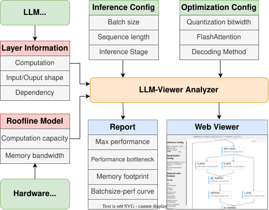

# LLM-Viewer


LLM-Viewer is a tool for visualizing Language Models (LLMs) and analyzing their performance on different hardware platforms via a roofline model — network-wise analysis of peak memory consumption and inference time. See the paper [LLM Inference Unveiled: Survey and Roofline Model Insights](https://arxiv.org/pdf/2402.16363.pdf).

> **Working with robotics / Vision-Language-Action models?** This repo also ships a **[VLA-Viewer →](README_VLA.md)** — a roofline analyzer for VLA models (vision encoder → LLM backbone → action head) on NVIDIA Jetson **edge devices**, with per-phase latency, memory-fit, and control-budget verdicts. It reuses this LLM roofline engine; the two are separate products in one app (`/llm` and `/vla`). See **[README_VLA.md](README_VLA.md)**.

---

## Workflow (roofline analysis)



1. Take the model and gather per-layer info: compute count, input/output tensor shapes, data dependencies.
2. Provide the hardware and build a roofline model from its compute capacity and memory bandwidth.
3. Configure inference settings (batch size, sequence/prompt length, generation length).
4. Configure optimization settings (quantization bitwidth, FlashAttention, decoding method).
5. The analyzer evaluates each op against the roofline, tracks memory usage, and aggregates to the whole network.
6. Report per-layer performance, bottlenecks, and memory footprint.
7. Explore interactively in the web viewer.

## Running locally (both viewers)

The app is a Flask backend + a Vue frontend.

```bash
# Python deps (a dedicated env is recommended)
pip install transformers flask flask_cors easydict numpy

# 1) backend — serves both the LLM (/get_graph) and VLA (/get_vla_graph) endpoints
python3 backend_app.py --local --port 5000

# 2) frontend — in another terminal
cd frontend && npm install && npm run dev
```

Open **http://localhost:5173/** — a landing page links to the two viewers:

- **`/llm`** — the LLM viewer (cloud GPUs). Set the **Server** dropdown to `127.0.0.1` (default points at the hosted backend).
- **`/vla`** — the VLA viewer (edge devices); see **[README_VLA.md](README_VLA.md)**.

> NOTE: roofline times are the theoretical hardware ceiling — use them for **relative** comparison, not absolute timings.

## LLM command line

```bash
pip install transformers flask flask_cors easydict
python3 analyze_cli.py facebook/opt-125m nvidia_A6000
python3 analyze_cli.py meta-llama/Llama-2-7b-hf nvidia_A6000 --batchsize 1 --seqlen 2048
# DiT models
python3 analyze_cli.py DiT-XL/2 nvidia_A6000 --batchsize 1 --seqlen 256 --source DiT
```

The hosted LLM viewer is at [LLM-Viewer Web](http://llm-viewer.com).

## Citation

If you use LLM-Viewer in your research, please cite the paper:

```
@misc{yuan2024llm,
      title={LLM Inference Unveiled: Survey and Roofline Model Insights},
      author={Zhihang Yuan and Yuzhang Shang and Yang Zhou and Zhen Dong and Chenhao Xue and Bingzhe Wu and Zhikai Li and Qingyi Gu and Yong Jae Lee and Yan Yan and Beidi Chen and Guangyu Sun and Kurt Keutzer},
      year={2024},
      eprint={2402.16363},
      archivePrefix={arXiv},
      primaryClass={cs.CL}
}
```
